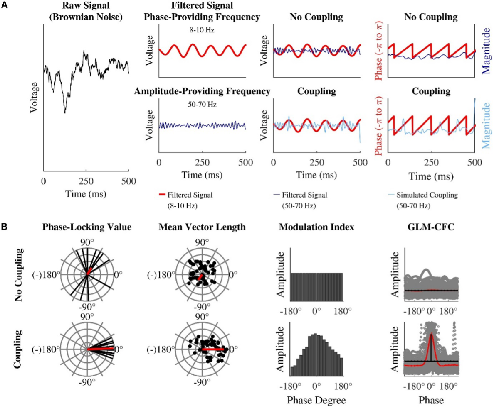
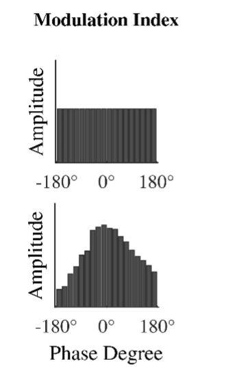

Calculating CFC 
=================

Calculating PAC
-----------------

There are multiple ways to calculate PAC between two oscillations. The widely used approaches are Modulation Index (MI) and Coupling Phase.

Simulation of the EEG signal and calculation of phase-amplitude coupling:

(A) (from left to right) Brownian noise is generated. This signal is band pass filtered to extract the slow phase-providing frequency (here 8–10 Hz, red line) and the fast amplitude-providing frequency (here 50–70 Hz, dark blue line). To simulate coupling (light blue line) the amplitude-providing band pass filtered signal is multiplied with a Hanning window plus one (not depicted here), which results in stronger amplitude at the peaks of the phase-providing frequency (lower middle right panel). 

(B) Idealized depiction PLV, MVL, MI, and GLM-CFC for a uniform distribution (upper panels) and phase-amplitude coupling (lower panels). PLV: each black line represents the phase lag between two signals at one data point. The red vector is the mean of all black vectors. The upper panel shows inconsistent, widespread phase lags. The widespread phase lags lead to a relatively short mean vector (red line). The outer left lower panel shows an example of a relative constant phase lag around 0°. A relative constant phase lag leads to a relatively long mean vector. MVL: each black dot represents one data point of the analytical signal. In case of coupling, a portion of the dots (or vectors) are especially long (reflecting strong amplitudes) at a specific narrow range of phase angles (here 0° in the lower panel). The red vector is the mean of all black vectors. It reflects coupling strength (short for no coupling – long for coupling). In case of phase-amplitude coupling it is indicating the preferred phase. MI: all possible phases are binned into 18 bins of 20° from –180 to 180°. Each bar reflects the mean amplitude of the amplitude-providing signal for the specified phase of the phase-providing frequency. This phase-amplitude plot is quantified with Shannon entropy. Shannon entropy is maximal for uniform distributions (upper panel). The Kullback–Leibler distance measures how much a given distribution (for example the one in the lower panel) deviates from the uniform distribution (depicted in the upper panel). The more phase-amplitude coupling there is in the data, the more the given phase-amplitude plot deviates from the uniform distribution and the higher the MI becomes. GLM-CFC: each circle in the scatter plot represents one data point. If there is no phase-amplitude coupling, amplitude values are rather similar across all possible phase values. In this case, a horizontal line would best model the data and the phase value would have no predictive power. If there is phase-amplitude coupling, amplitude values are specifically high at certain phase values. In this case, a curve that follows the amplitude pattern would best model the data. In case of phase-amplitude coupling, the curve (red line) differs from the horizontal line (black line) that represents no coupling. In case of no phase-amplitude coupling the curve barely differs from the null model horizontal line that represents no coupling. Figure taken from Hülsemann et al. 2019.

Hülsemann MJ, Naumann E, Rasch B. Quantification of Phase-Amplitude Coupling in Neuronal Oscillations: Comparison of Phase-Locking Value, Mean Vector Length, Modulation Index, and Generalized-Linear-Modeling-Cross-Frequency-Coupling. Front Neurosci. 2019 Jun 7;13:573. doi: 10.3389/fnins.2019.00573. PMID: 31275096; PMCID: PMC6592221. `<https://www.frontiersin.org/articles/10.3389/fnins.2019.00573/full>`_.

Modulation Index
----------------
Modulation Index (MI) is the method to calculate PAC between two brain oscillations.
MI quantifies how much the amplitude of the a given frenquency oscillation changes depending on the phase of the other frequency oscillation.

The general steps to compute PAC using MI:

1. Preprocess the data by applying bandpass filtering to extract the low-frequency (phase) and high-frequency (amplitude) oscillations.

2. Construct a phase-amplitude histogram by dividing the phase of the low-frequency oscillation into bins (i.e. 18 bins of 20° from –180 to 180°) and calculating the mean amplitude of the high-frequency oscillation for each bin.

3. Normalize the histogram to obtain a more robust estimate of the PAC by using the 25th and 75th percentiles as reference points, which makes it more resistant to outliers.

4. Fit a sinusoidal function to the normalized histogram using a non-linear least-squares algorithm to obtain the best fit.

5. Calculate the Modulation Index (MI) as the difference between the peak amplitude of the sinusoidal function and the mean amplitude across all bins, divided by the mean amplitude.

6. Assess the significance of the PAC estimate using statistical tests or surrogate data.

The value of MI ranges from 0 (no coupling) to 1 (perfect coupling), with higher values indicating stronger PAC.

All possible phases are binned into 18 bins of 20° from –180 to 180°. Each bar reflects the mean amplitude of the amplitude-providing frequency for the specified phase of the phase-providing frequency across a defined period of time (e.g. across the night, for REM sleep, for each spindle). This phase-amplitude plot is then quantified with Shannon entropy. Shannon entropy is maximal for uniform distributions (upper panel). The Kullback–Leibler distance quantifies the divergence between two distributions in terms of their Shannon entropy. As we wish to quantify the degree to which the phase-amplitude relationship is non-uniform, we take the MI as the Kullback-Leibler distance between the the given phase-amplitude distribution (for example the one in the lower panel) and the uniform distribution (depicted in the upper panel). The more phase-amplitude coupling there is in the data, the more the given phase-amplitude plot deviates from the uniform distribution and the higher the MI becomes.

The popularity of MI in PAC:

-  The MI can detect multimodal coupling (i.e. coupling with >1 preferred phase).

-  The MI is most robust against confounding influences of data length, signal-to-noise-ratio, and sampling rate.

-  The MI is recommended for noisy and short data epochs with unknown forms of coupling.

Tort, A. B. L. , Kramer, M. A. , Thorn, C. , Gibson, D. J. , Kubota, Y. , Graybiel, A. M. , & Kopell, N. J. (2008). *Dynamic cross‐frequency couplings of local field potential oscillations in rat striatum and hippocampus during performance of a T‐maze task.* Proceedings of the National Academy of Sciences, 105(51), 20517–20522. 10.1073/pnas.0810524105

Direct Modulation Index (dMI)
-----------------------------

The direct modulation index (dMI) is another measure used to quantify PAC. Instead of using 18 phase bins of 20 degree wide, dMI uses 360 overlapping phase bins of 20° width each, shifted in steps of 1°, in order to obtain a better model fit.
A composite signal is then constructed from the phase of the low‐frequency signal and the amplitude of the high‐frequency signal, and the mean amplitude is calculated across phase bins. The phase-amplitude histogram is then normalized using the 25th and 75th percentiles as reference points instead of the minimum and maximum values, based on the interquartile range, to make it more robust against outliers. The normalized histogram is scaled and shifted to result in a normalized histogram ranges from -1 to 1.

The dMI measure, as well as other reliable measures to estimate neurophysiological interactions for example, in the same frequency band, is freely available as a Python toolbox at `<https://github.com/neurophysiological-analysis/FiNN>`_.

Scherer M, Wang T, Guggenberger R, Milosevic L, Gharabaghi A. Direct modulation index: A measure of phase amplitude coupling for neurophysiology data. Hum Brain Mapp. 2023 Apr 1;44(5):1862-1867. doi: 10.1002/hbm.26190. Epub 2022 Dec 29. PMID: 36579658; PMCID: PMC9980882.
`<https://www.ncbi.nlm.nih.gov/pmc/articles/PMC9980882/>`_.

Coupling Phase
---------------

This metric, also termed the “preferred phase”, determines where in the phase of the nesting frequency signal the nested frequency most consistently has a maxmimal amplitude. Coupling Phase is often represented as a vector in the complex plane, with the length and angle of the vector indicating the strength and phase relationship of the coupling, respectively.

Canolty RT, Edwards E, Dalal SS, Soltani M, Nagarajan SS, Kirsch HE, Berger MS, Barbaro NM, Knight RT. High gamma power is phase-locked to theta oscillations in human neocortex. Science. 2006 Sep 15;313(5793):1626-8. doi: 10.1126/science.1128115. PMID: 16973878; PMCID: PMC2628289.
`<https://www.ncbi.nlm.nih.gov/pmc/articles/PMC2628289/>`_.

Both the MI and Coupling Phase are widely used measures in PAC analysis, but they have different strengths and limitations. The MI is a more robust measure that can detect multimodal coupling regardless of duration of data or the shape of coupling. In contrast, Coupling Phase provides a more detailed characterization of the phase relationship between two oscillations and can be used to study the dynamics of the coupling over time.

In summary, the MI and Coupling Phase are complementary measures that can provide different insights into the nature and strength of PAC between two oscillations. 

