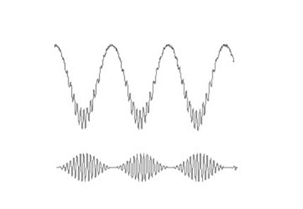

Cross Frequency Coupling (CFC)
==============================

What is CFC
-----------

Cross-frequency coupling (CFC) is a phenomenon that describes the relationship between two or more brain oscillations of different frequencies. That means that one amplitdue or phase of a given frequency band modulates the amplitude or phase of another frequency band.

For example, it has been showed that CFC between theta (i.e. 4-8 Hz) and gamma (i.e. 30-100 Hz) oscillations during rapid eye movement (REM) sleep. This phenomenon has been associated with several cognitive processes, such as memory consolidation, attention, and perception.

phase amplitude coupling (PAC)
~~~~~~~~~~~~~~~~~~~~~~~~~~~~~~

phase amplitude coupling (PAC) is a specific type of CFC that involves the phase of a low-frequency oscillation and the amplitude of a high-frequency oscillation. For example, PAC refers to the relationship between the phase of a low-frequency brain rhythm (i.e theta or alpha) and the amplitude of a higher frequency rhythm (i.e. gamma or beta). 

phase phase coupling (PPC)
~~~~~~~~~~~~~~~~~~~~~~~~~~~
Phase-phase coupling (PPC) is a phenomenon that describes the relationship between two brain oscillations of the same frequency. For example, in the human brain, there is evidence of phase-phase coupling between alpha oscillations in different brain regions during visual processing. 

References: Canolty, R. T., & Knight, R. T. (2010). The functional role of cross-frequency coupling. Trends in cognitive sciences, 14(11), 506-515.

Modulation Index
----------------
Modulation Index (MI) is a measure used in the analysis of brain oscillations that reflects the degree of phase-amplitude coupling (PAC) between two oscillations.
