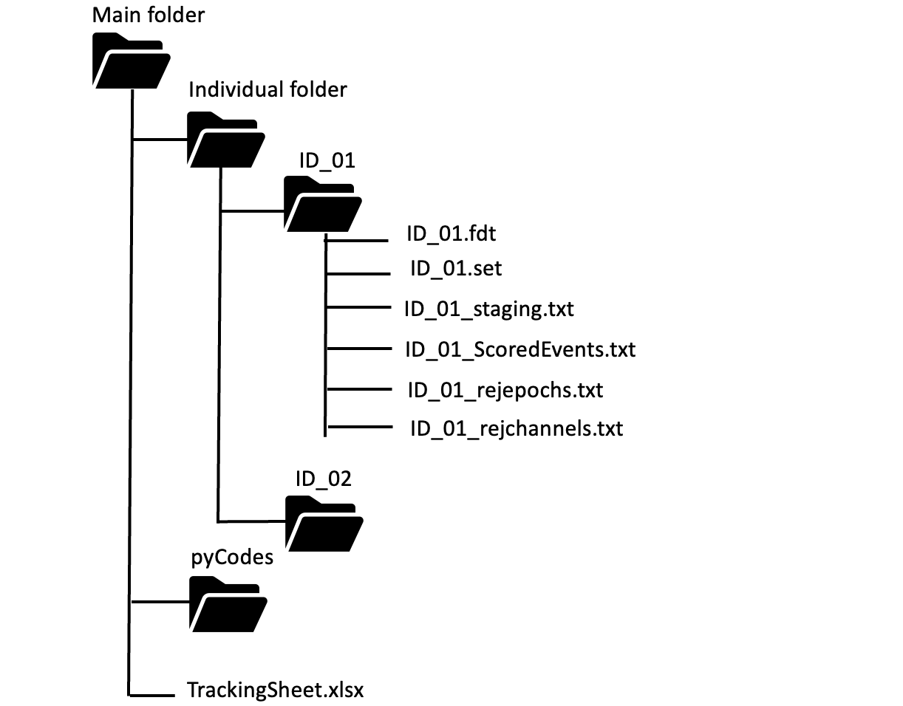

Get Started
===========

Data Preparation 
-----------------

prepare clean EEG signal from UWM pipeline or EEG_processor 
edt files, stage files

1. EEG recordings: 
The cleaned overnight high-density EEG recordings.fdt and .set. The .fdt file contains the raw EEG signals and the .set file contains meta-information of recordings (i.e. number of channels, sampling rate, and other relative information)

.. image:: img/overview_dataset.png
    :width: 300px
    :align: center
    :height: 200px
    :alt: alternate text

2. Sleep staging and scored event files: 
The files contain staging, arousal and respiratory events as scored by accredited sleep technologists were saved in txt or csv format. Data in both files were synchronised to the PSG data;

.. list-table::
   :widths: 50 50
   :header-rows: 0

   * - .. image:: img/staging.png
     - .. image:: img/scoredEvents.png

3. Rejected channels and epochs files: Lists of poor quality EEG channels and artifect epochs were saved in txt or csv format as separate files.

.. list-table::
   :widths: 50 50
   :header-rows: 0

   * - .. image:: img/rejchans.png
          :alt: Rejected channels
     - .. image:: img/rejepochs.png
          :alt: Rejected epochs

The above folder contents were then converted to a single .xml annotations file, to be used in all further analyses. 

Data Organization
-----------------

The organization and location of data are critical for the proper functioning of Python scripts. For current scripts to compute CFC, the required data structure is as follows:

1.  Main folder: contains individuval folder, pyCodes, and TrackingSheet.xlsx. 

2.  Individuval folder: each subject folder should follow the same naming convention. It doesn’t matter what they are called, as long as it is consistent, and doesn’t contain spaces (e.g. ID_01)

3.  Within each subject folder, the following files should contain :

  a.  ID_01.fdt and ID_01.set

  b.  ID_01_staging.txt

  c.  ID_01_ScoredEvents.txt

  d.  ID_01_rejepochs.txt

  e.  ID_01_rejchannels.txt

  See 'Data Preparation' section for the details of each item.

4. pyCodes: contains all python scripts

5. TrackingSheet.xlsx / TrackingSheet_HdEEG.xlsx

Rename the subject IDs in the 'ID' column of the 'TrackingSheet.xlsx' / 'TrackingSheet_HdEEG.xlsx' file to match the naming convention used in the previous section. Additionally, add a column titled 'System' with the recording system name (e.g. EGI) for each subject. 

If you have multiple subjects, you can include all subject IDs in the 'ID' column and the corresponding recording system in the 'System' column. You should able to run the scripts for all subjects' data at once.

The script will import all the data information into an annotations file for each subject, so that these can be used for all future analysis.

