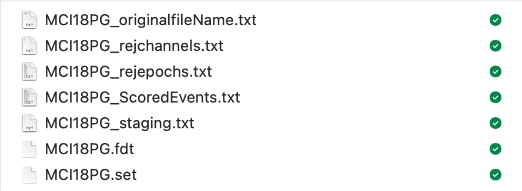

Get Started
===========

Data Preparation 
-----------------

prepare clean EEG signal from UWM pipeline or EEG_processor 
edt files, stage files

1. EEG recordings: 
The cleaned overnight high-density EEG recordings.fdt and .set. The .fdt file contains the raw EEG signals and the .set file contains meta-information of recordings (i.e. number of channels, sampling rate, and other relative information)

2. Sleep staging and scored event files: 
The files contain staging, arousal and respiratory events as scored by accredited sleep technologists were saved in .txt or .csv format. Data in both files were synchronised to the PSG data;

.. raw:: html

   <table>
     <tr>
       <td></td>
       <td></td>
     </tr>
   </table>

3. Rejected channels and epochs files: Lists of poor quality EEG channels and artifect epochs were saved in .txt or csv format as separate files.

Data Preparation 
-----------------

Stuff in section

Generate dataset to Wonambi
---------------------------

Stuff in section