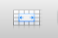

Visualize Signals in Wonambi
============================

The following steps to visualize EEG signal in Wonambi:

Import data into Wonambi
------------------------

1. typing wonambi in terminal:

>> wonambi

2.	Open a new recording by clicking the |icon1|  in the top right of the screen. Click File when it asks to open a File or Directory.

3.	Navigate to the study (i.e. .edf file or .fdt file) and click Open.

4.	Next open the Annotations file (with sleep staging and event markers), by clicking Load Annotations in the toolbar.

5.	Navigate to the annotations (.xml file) and click Open.

6.	Next load the montage to observe the EEG traces, by clicking Load Montage in the toolbar (if no montages available for your dataset, see Setting a Montage)

7.	Navigate to the montage (.json file) and Click Open.

8. You should see the image like this:

Setting a Montage
------------------

To view your actual EEG data in wonambi, you will need a montage. If you don’t already have one saved for your dataset (as they are specific to the naming conventions and selected references), you can create one.

1.	In the wonambi GUI, once you have loaded your recording, select Windows -> Channels

2.	Click New.

3.	Type a name for the new selection (e.g. ‘EEG')

4.	Select your channels, references (to select more than one channel at a time hold down the Ctl key), lowpass, highpass and notch filters.

5.	Click Apply. Your eeg trace should now appear.

6.	To save, click Save Montage in the toolbar.

Marking events
--------------

1.	To add or delete events (e.g. spindles), turn Event Mode on by clicking the |icon2|  icon in the toolbar.

a.	To delete an event, click on the event embedded in the EEG trace. It should turn yellow. Press Delete on the keyboard.

b.	To add an event, first select the event type by choosing from the drop down menu next to the Event Mode icon |icon3|. Once you have selected the correct event type, click and drag across the EEG trace and release when you have covered the whole event. 

NOTE: if you only do this on one channel, the maker will look darker on that trace but will not be embedded in the other channels. 

To make sure the event covers all the channels, click and drag over the event, and down so that the mouse covers at least 2 channels before releasing the mouse button.

2.	Any changes will be automatically saved, so be careful to not delete any events unnecessarily - or you will need to manually add them back.  

3.	When you are finished, just close the window, or open a new recording.

Wonambi documentation 
---------------------

For the details of wonambi interface, please visit the website:

`<https://wonambi-python.github.io/gui/index.html>`_.

